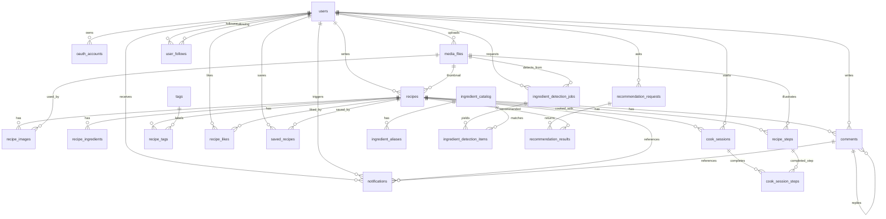

# 찰칵밥상 ERD 구성안

이 문서는 현재 프론트 기능과 백엔드 API 명세를 기준으로 ERDCloud에 구성할 테이블, 관계, 배치 기준을 정리한 문서입니다.

## ERDCloud 구성 순서

1. MySQL 기준이면 `docs/ssafagetti-erd.sql`, PostgreSQL 기준이면 `docs/ssafagetti-erd.postgresql.sql` 파일 내용을 ERDCloud SQL import 또는 DDL 입력 기능에 붙여 넣습니다.
2. 테이블 그룹을 아래 도메인 단위로 묶어 배치합니다.
3. `users`와 `recipes`를 중앙 축으로 놓고, 소셜/알림/추천/요리모드를 주변에 배치합니다.

## 도메인 그룹

### 1. 사용자 / 인증

- `users`: 이메일/구글 사용자 공통 계정
- `oauth_accounts`: 구글 로그인 제공자 계정 연결
- `media_files`: 프로필, 레시피, 조리 단계, 재료 인식 이미지 공통 파일

### 2. 레시피 본문

- `recipes`: 레시피 대표 정보, 작성자, 썸네일, 카운트 캐시
- `recipe_images`: 레시피 상세 이미지 목록
- `recipe_ingredients`: 재료명, 양, 단위, 정렬 순서
- `recipe_steps`: 조리 단계, 단계별 이미지, 타이머
- `tags`: 태그 마스터
- `recipe_tags`: 레시피-태그 N:M 관계

### 3. 소셜 기능

- `recipe_likes`: 좋아요 토글
- `saved_recipes`: 저장 토글
- `comments`: 댓글 및 작성자 답글
- `user_follows`: 작성자 구독/팔로우

### 4. 알림

- `notifications`: 회원가입 환영, 좋아요, 댓글, 답글 알림과 읽음 상태

### 5. 재료 / 추천

- `ingredient_catalog`: 재료 표준 사전
- `ingredient_aliases`: 달걀/계란 같은 별칭
- `ingredient_detection_jobs`: AI 재료 인식 요청
- `ingredient_detection_items`: 인식된 재료 후보
- `recommendation_requests`: 재료 기반 추천 요청
- `recommendation_results`: 추천 결과와 매칭률

### 6. 모바일 요리모드

- `cook_sessions`: 모바일 가로 요리모드 진행 세션
- `cook_session_steps`: 완료한 단계 기록

## 핵심 관계 요약

## 프론트 기능과 매칭

| 프론트 기능 | 주요 테이블 |
| --- | --- |
| 이메일/구글 회원가입, 로그인 | `users`, `oauth_accounts`, `notifications` |
| 환영 알림, 좋아요/댓글 알림 | `notifications`, `recipe_likes`, `comments` |
| 레시피 등록/수정 | `recipes`, `recipe_images`, `recipe_ingredients`, `recipe_steps`, `recipe_tags` |
| 홈 인기 레시피/오늘의 추천/최근 마이 레시피 | `recipes`, `recipe_likes`, `recipe_tags`, `saved_recipes` |
| 피드 검색/태그 AND 필터 | `recipes`, `tags`, `recipe_tags` |
| 좋아요/저장/댓글/작성자 답글 | `recipe_likes`, `saved_recipes`, `comments`, `notifications` |
| 마이페이지 | `users`, `recipes`, `saved_recipes`, `recipe_likes`, `user_follows` |
| 재료 입력/AI 재료 인식/추천 | `ingredient_catalog`, `ingredient_aliases`, `ingredient_detection_jobs`, `recommendation_requests`, `recommendation_results` |
| 모바일 가로 요리모드 | `cook_sessions`, `cook_session_steps`, `recipe_steps`, `recipe_likes` |

## 배치 추천

- 중앙: `users`, `recipes`
- 왼쪽: 인증/프로필 계열 `oauth_accounts`, `media_files`
- 오른쪽: 레시피 구성 계열 `recipe_images`, `recipe_ingredients`, `recipe_steps`, `tags`, `recipe_tags`
- 아래쪽: 액션 계열 `recipe_likes`, `saved_recipes`, `comments`, `notifications`
- 오른쪽 아래: 추천/AI 계열 `ingredient_*`, `recommendation_*`
- 왼쪽 아래: 요리모드 계열 `cook_sessions`, `cook_session_steps`

## 서버 구현 메모

- `recipes.like_count`, `comment_count`, `save_count`는 조회 성능을 위한 캐시 필드입니다. 좋아요/댓글/저장 트랜잭션에서 함께 증감합니다.
- `recipe_tags`는 태그 AND 필터를 위해 `tag_id` 기준 인덱스가 필요합니다.
- `comments.parent_comment_id`로 답글을 표현하고, `is_author_reply`는 서버에서 레시피 작성자 여부를 검증해 설정합니다.
- `notifications.receiver_user_id + is_read + created_at` 인덱스는 빨간 카운트 배지와 알림 목록 성능을 위한 핵심 인덱스입니다.
- 재료 검색어 20자 제한은 프론트 UX 보호와 별개로 서버에서도 검증합니다.
- 요리모드는 프론트 로컬 상태만으로도 동작 가능하지만, 진행률/완료율 분석이 필요하면 `cook_sessions` 계열 테이블을 활성화합니다.
- PostgreSQL에서는 `updated_at` 자동 갱신을 위해 DB 트리거를 추가하거나 서버 애플리케이션에서 업데이트 시점에 값을 갱신합니다.
